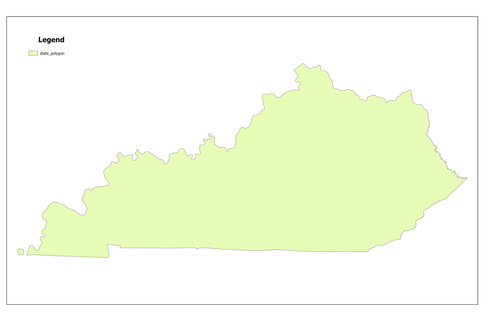

# Hello trees

A map made from lidar derived surface elevations and made in ArcGIS Pro Spring 2025.

* Data from kyraster.ky.gov
* NDVI greater 0.1 values used to find vegetated areas
* Heights greater 5 feet

[Visit my webpage](https://pg-cloud.com/LexingtonKY/)

## My map image

## Kentucky outline

   
*Download [GeoPDF](ky-outline.pdf)*   